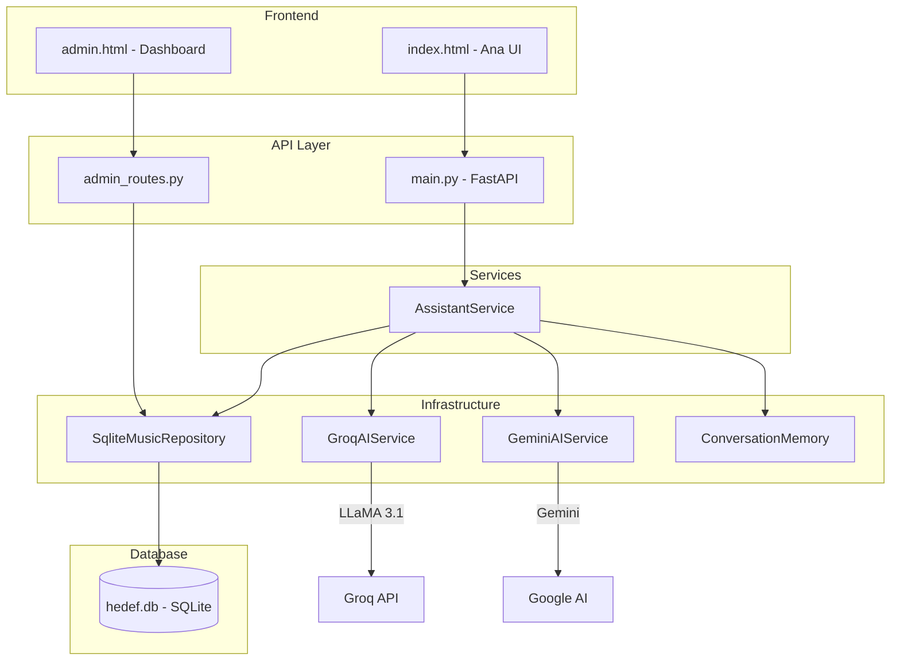
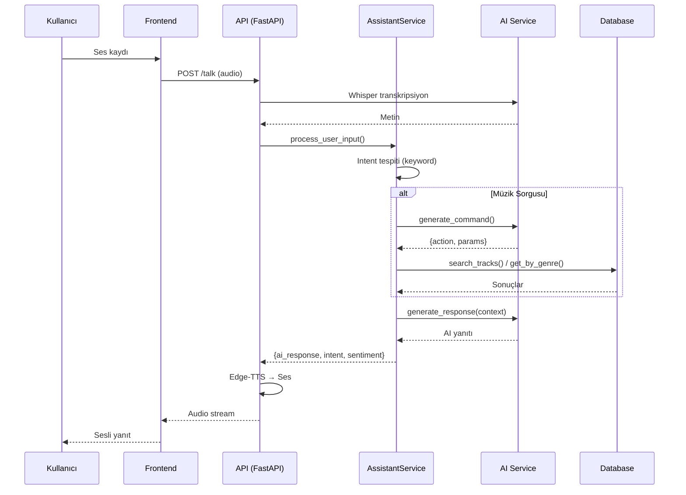

# 🎵 TechFix Müzik Sesli Asistan - Proje Raporu

## Genel Bakış

**TechFix Müzik Sesli Asistan**, müşterilerin sesli komutlarla müzik araması yapabildiği, ürün bilgisi alabildiği ve şirket hakkında bilgi edinebileceği **yapay zeka destekli bir müşteri hizmetleri sistemidir**.

---

## 🏗️ Mimari (Clean Architecture)



---

## 📁 Dosya Yapısı

| Klasör/Dosya | Açıklama |
|--------------|----------|
| `app/main.py` | FastAPI uygulaması, endpoint'ler |
| `app/core/config.py` | Ayarlar, şirket bilgileri |
| `app/core/interfaces.py` | Soyut arayüzler (DI için) |
| `app/services/assistant_service.py` | İş mantığı katmanı |
| `app/infrastructure/ai/` | AI servisleri (Groq, Gemini) |
| `app/infrastructure/database/` | SQLite repository |
| `app/infrastructure/memory.py` | Redis/In-memory konuşma hafızası |
| `app/routes/admin_routes.py` | Admin API endpoint'leri |
| `index.html` | Ana kullanıcı arayüzü |
| `admin.html` | Admin Dashboard |

---

## ⚙️ Temel Özellikler

### 1. Sesli Asistan
- **Ses Tanıma**: Whisper (Groq API) ile Türkçe ses transkripti
- **Doğal Dil İşleme**: Intent tespiti, duygu analizi
- **Sesli Yanıt**: Edge TTS ile doğal Türkçe ses

### 2. Müzik Veritabanı Entegrasyonu
- Şarkı/albüm/sanatçı arama
- Tür bazlı filtreleme (Rock, Pop, Jazz vb.)
- Fiyat sorguları (en ucuz/pahalı)

### 3. Admin Dashboard
- Görüşme kayıtları tablosu
- İstatistik kartları (toplam çağrı, son 24 saat)
- Otomatik yenileme, responsive tasarım

### 4. Konuşma Hafızası
- Oturum bazlı bağlam koruma
- Redis veya In-Memory desteği

---

## 🔧 Teknoloji Stack

| Kategori | Teknoloji |
|----------|-----------|
| **Backend** | FastAPI, Uvicorn, Python 3.10+ |
| **AI/LLM** | Groq (LLaMA 3.1), Google Gemini |
| **Ses** | Whisper (ASR), Edge-TTS |
| **Veritabanı** | SQLite + SQLAlchemy |
| **Hafıza** | Redis (opsiyonel) |
| **Frontend** | Vanilla HTML/CSS/JS |

---

## 🔄 İş Akışı



---

## 📊 API Endpoint'leri

| Method | Endpoint | Açıklama |
|--------|----------|----------|
| GET | `/` | Ana sayfa (index.html) |
| GET | `/admin` | Admin Dashboard |
| POST | `/talk` | Sesli konuşma |
| POST | `/end-call` | Görüşme özeti |
| GET | `/api/admin/logs` | Görüşme kayıtları |
| GET | `/api/admin/stats` | İstatistikler |

---

## 🚀 Nasıl Çalıştırılır

```bash
# 1. Bağımlılıkları kur
pip install -r requirements.txt

# 2. .env dosyasını ayarla
GROQ_API_KEY=your_key
GEMINI_API_KEY=your_key  # Opsiyonel
AI_PROVIDER=groq  # veya "gemini"

# 3. Uygulamayı başlat
python -m uvicorn app.main:app --host 0.0.0.0 --port 8000
```

**Erişim:**
- Ana Sayfa: [http://localhost:8000](http://localhost:8000)
- Admin: [http://localhost:8000/admin](http://localhost:8000/admin)

---

## 📈 Gelecek Geliştirmeler (Öneriler)

- [ ] Kullanıcı kimlik doğrulama (Admin Dashboard için)
- [ ] Webhook entegrasyonları (Slack, Discord)
- [ ] Detaylı analitik raporlar
- [ ] Multi-language desteği
- [ ] Mobil uygulama (React Native / Flutter)
