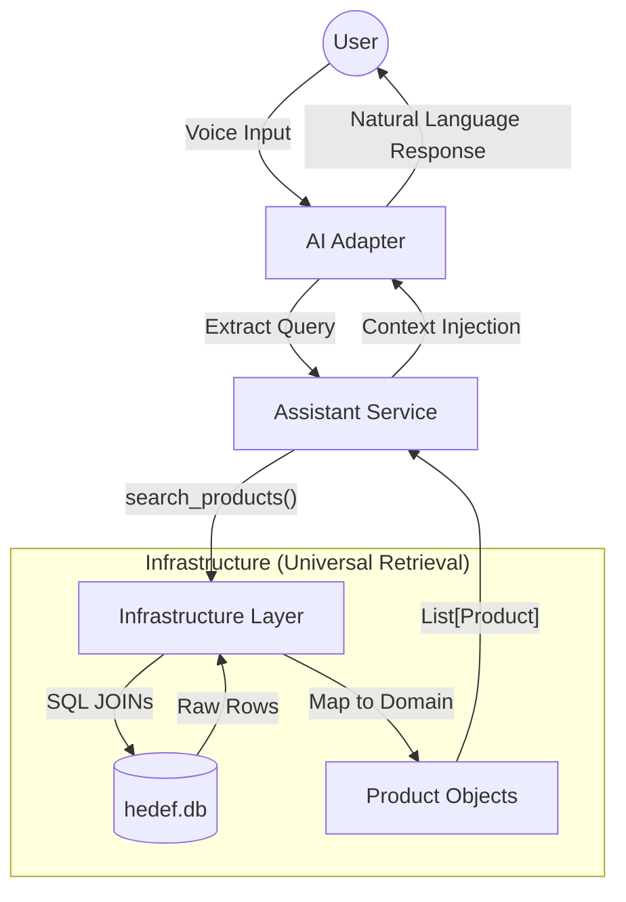
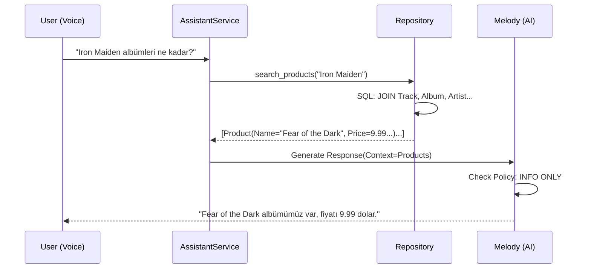

# Melody System Architecture: Universal Retrieval

## High-Level Overview
Refactoring from tightly-coupled intent logic to a loose-coupled **Retrieval-Augmented Generation (RAG)** architecture.

## Key Components

### 1. Domain Object (`Product`)
The universal language of the system.
- **Independence:** Does not know about SQL or Tables.
- **Fields:** `id`, `name`, `price`, `description` (Rich text).

### 2. Universal Repository (`SqliteRepository`)
The only component that knows SQL.
- **Single Entry Point:** `search_products(query: str, limit: int = 5)`.
- **Logic:**
  - Performs complex JOINs (Track + Album + Artist + Genre).
  - Filters validation (Security).
  - **Token Safety:** Enforces HARD LIMIT of 5 items.
  - **Mapping:** Maps DB result to Product.

### 3. Melody Logic (Service + AI)
- **Service:** radically simplified. "Get data, Pass to AI".
- **AI (Melody):**
  - **Input:** User Query + List of Products.
  - **Decision:** "User asked for price? I see price in Product object. I will say it."
  - **Constraint:** NO ORDERS.

## Sequence Diagram

## Core Engineering Principles (The Manifesto)
This project is built on strict adherence to the following pillars. Any future changes MUST comply with these rules:

### 1. Agile & Test-First (TDD)
- **Test First:** We write failing tests *before* writing implementation code.
- **Red-Green-Refactor:** Make it fail, make it work, then make it clean.
- **Verification:** Security, Business, and Integration tests run automatically. We trust the test suite more than manual checks.

### 2. Lazy Coupling (Gevşek Bağlılık)
- **Principle:** High-level modules (AI, Service) should NOT depend on low-level implementation details (SQL, Tables).
- **Implementation:** 
    - The `Service` layer never asks "Get me Track table". 
    - It only asks "Search for 'Metallica'". 
    - The `Repository` is a black box that returns generic `Product` objects.
- **Benefit:** Replacing SQLite with MongoDB requires **zero** changes to the Service or AI layer.

### 3. Layered Architecture
- **Strict Separation:**
    - `Domain` (Product): Knows nothing about DB or AI.
    - `Infrastructure` (Repository, Groq): Knows external systems (SQL, API).
    - `Service` (AssistantService): Orchestrates logic, depends on Interfaces.
    - `Presentation` (FastAPI): Just handles HTTP/WebSockets.
- **Rule:** A lower layer never depends on a higher layer.
